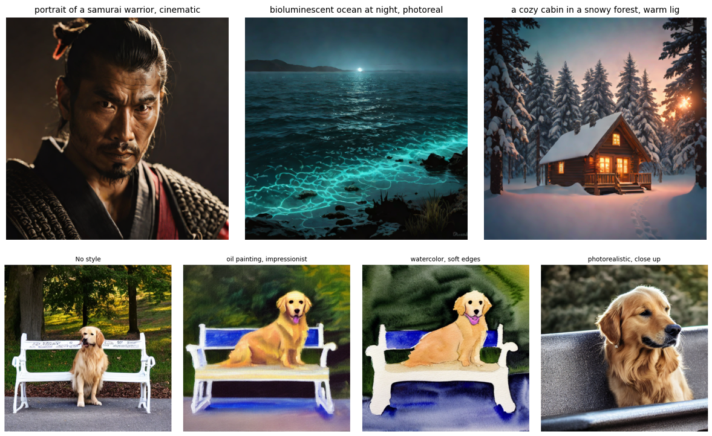
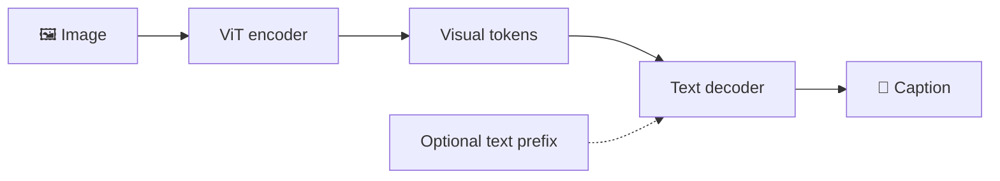
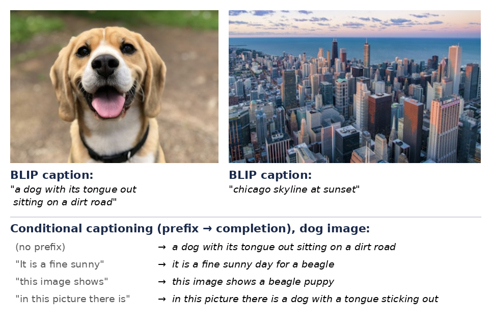
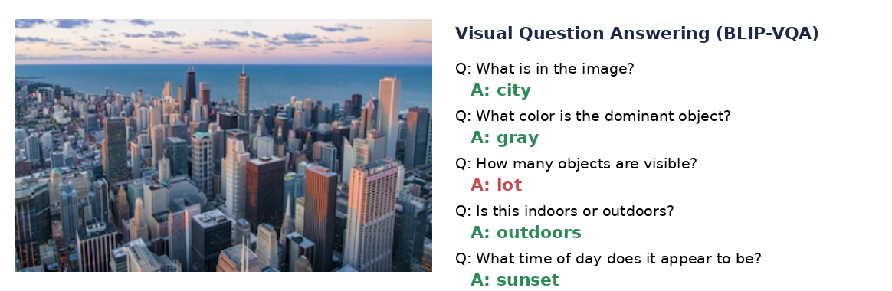
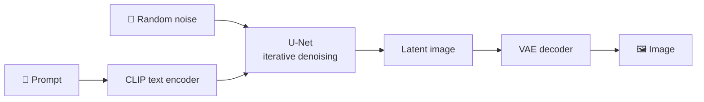
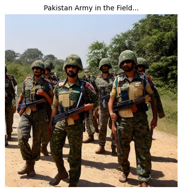
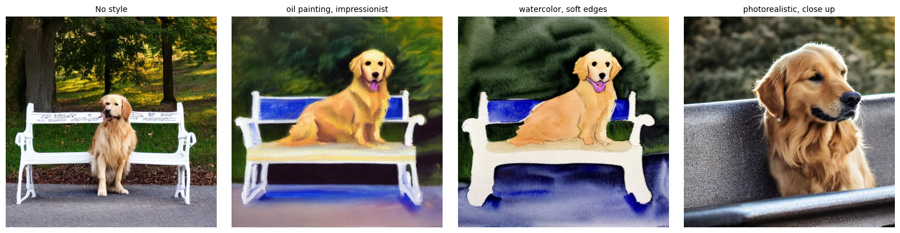
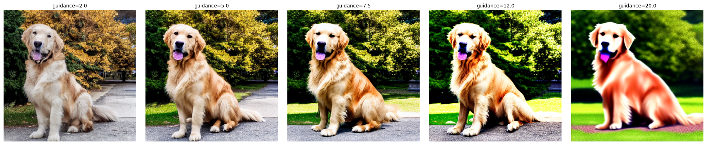
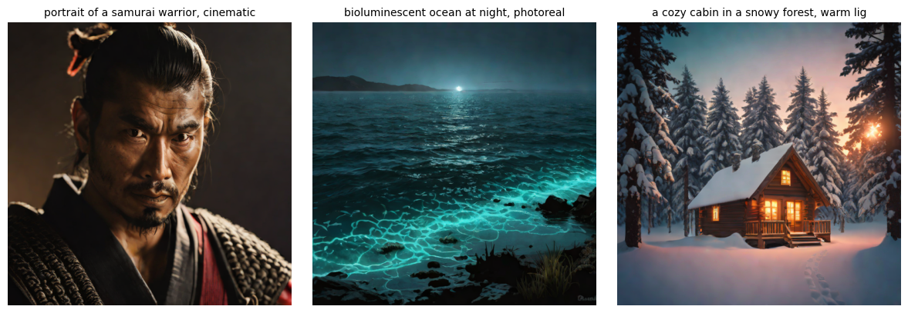
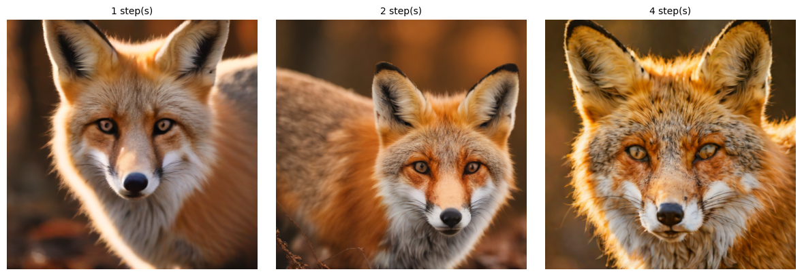

# 🎨 Multimodal Vision: Image Captioning, VQA & Text-to-Image

[](https://colab.research.google.com/github/MMujtabaX/CV-Project/blob/main/CV_05_Multimodal.ipynb)


Exploring models that connect **vision and language** in both directions: **image → text** with BLIP (captioning and visual question answering) and **text → image** with Stable Diffusion 1.5 and SDXL Turbo. It includes hands-on experiments with prompt style, guidance scale and inference steps. Everything runs on a free Colab T4 GPU.

<p align="center">
  
</p>
<p align="center"><sub>Top: SDXL Turbo in 4 steps. Bottom: Stable Diffusion 1.5, same subject in four prompt styles.</sub></p>

## 🧭 Overview

| Task | Direction | Model | Input → Output |
|------|-----------|-------|----------------|
| Image captioning | Image → Text | `Salesforce/blip-image-captioning-base` | Image → description |
| Visual question answering | Image + Text → Text | `Salesforce/blip-vqa-base` | Image + question → answer |
| Text-to-image | Text → Image | `stable-diffusion-v1-5` | Prompt → 512×512 image |
| Fast text-to-image | Text → Image | `stabilityai/sdxl-turbo` | Prompt → image in 1–4 steps |

## 📝 1. Image Captioning with BLIP

BLIP pairs a **Vision Transformer (ViT) image encoder** with a **text decoder**. The ViT turns the image into visual tokens, and the decoder writes text conditioned on them.



<p align="center">
  
</p>

**Conditional captioning** steers the output with a text prefix that BLIP completes. Notice how the prefix changes the level of detail: the unconditioned caption says "a dog", while two of the prefixed versions correctly identify a **beagle**. BLIP also recognized the **Chicago skyline** from the city photo.

## ❓ 2. Visual Question Answering

<p align="center">
  
</p>

BLIP-VQA answers questions about the scene, color, setting and time of day correctly. **Counting is its weak spot:** asked how many objects are visible, it answered "lot". VQA models are known to struggle with counting, which usually needs a dedicated detection model.

## 🖌️ 3. Text-to-Image with Stable Diffusion 1.5

Stable Diffusion is a **latent diffusion model**. It starts from random noise and removes it step by step, guided by the text prompt, inside a compressed latent space. A VAE then decodes the result into pixels.



<p align="center">
  
</p>
<p align="center"><sub>Prompt: "Pakistan Army in the Field" · 30 steps · guidance 7.5 · with a negative prompt to avoid blur and artifacts</sub></p>

### Prompt engineering

The same subject with different style keywords, generated with the same seed:

<p align="center">
  
</p>

### Guidance scale

`guidance_scale` controls how strongly the image follows the prompt:

<p align="center">
  
</p>

Low guidance (2.0) gives softer, more natural images. The usual range of **7–12** follows the prompt well. Very high guidance (**20.0**) **over-saturates** the image, with unnatural colors and harsh contrast, a classic sign of over-guidance.

## ⚡ 4. SDXL Turbo: Images in 1–4 Steps

SDXL Turbo uses **Adversarial Diffusion Distillation (ADD)** to compress the usual 25–50 denoising steps into **1–4**. It runs with `guidance_scale=0.0`, since the distilled model doesn't use classifier-free guidance.

<p align="center">
  
</p>

### How many steps does it need?

<p align="center">
  
</p>

Even **a single step** produces a coherent, detailed fox. More steps mainly refine texture and lighting. On a T4, each step takes a fraction of a second, which makes near-real-time generation possible.

## 💡 Key Takeaways

- **Multimodal models connect vision and language through shared representations.** BLIP aligns image and text features; Stable Diffusion conditions image generation on CLIP text embeddings.
- **Prompts are a control surface:** a few style words completely change the output.
- **Guidance scale is a trade-off** between prompt adherence and natural-looking images.
- **Distillation changes the speed–quality balance:** SDXL Turbo matches much slower pipelines in 1–4 steps.
- **VQA has clear limits,** especially counting, so check answers rather than trusting them blindly.

## 🚀 Run It

1. Click the **Open in Colab** badge above.
2. Choose **Runtime → Change runtime type → T4 GPU**.
3. Choose **Runtime → Run all**. Models download automatically from Hugging Face: about 1 GB for BLIP, 1.5 GB for BLIP-VQA, ~4 GB for SD 1.5 and ~6 GB for SDXL Turbo.

```bash
pip install torch transformers diffusers accelerate
```

The notebook frees Stable Diffusion 1.5 from GPU memory before loading SDXL Turbo, so both fit on a 15 GB T4.

## 🙏 Acknowledgements

Based on computer vision course material; run, fixed and documented by me. Models from [Salesforce BLIP](https://huggingface.co/Salesforce), [Stable Diffusion v1.5](https://huggingface.co/stable-diffusion-v1-5/stable-diffusion-v1-5) and [Stability AI SDXL Turbo](https://huggingface.co/stabilityai/sdxl-turbo).

## 👤 Author

**Muhammad Mujtaba Khan Suri** — CS @ UBIT, University of Karachi
[GitHub](https://github.com/MMujtabaX)
